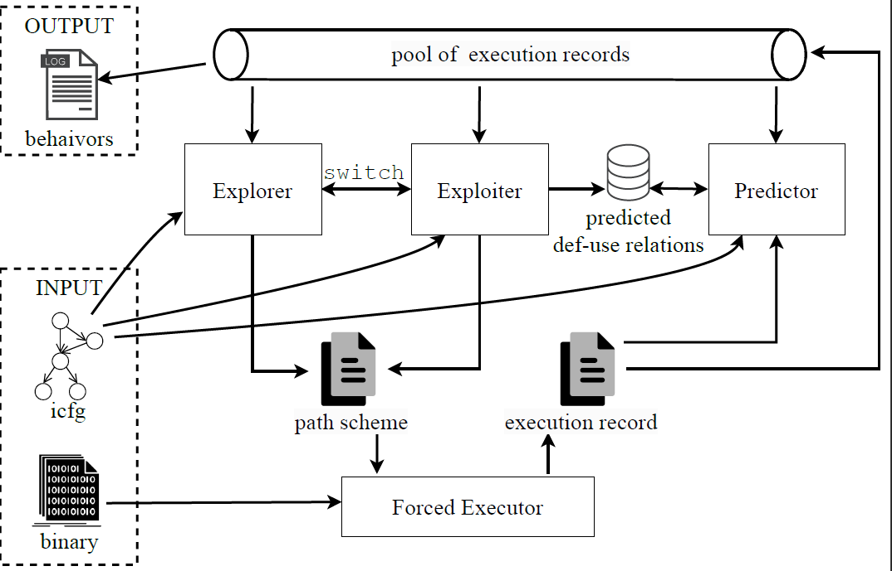

# DueForce

Docker repository for "Define-Use Guided Path Exploration for Better Forced Execution" (in *ISSTA'24*). Please refer to the [paper](https://www.youwei.site/papers/ISSTA2024.pdf) for technical details.

## Architecture 

## Pre-compiled Docker 

Referred to [artifact](https://zenodo.org/records/12669304) for details.